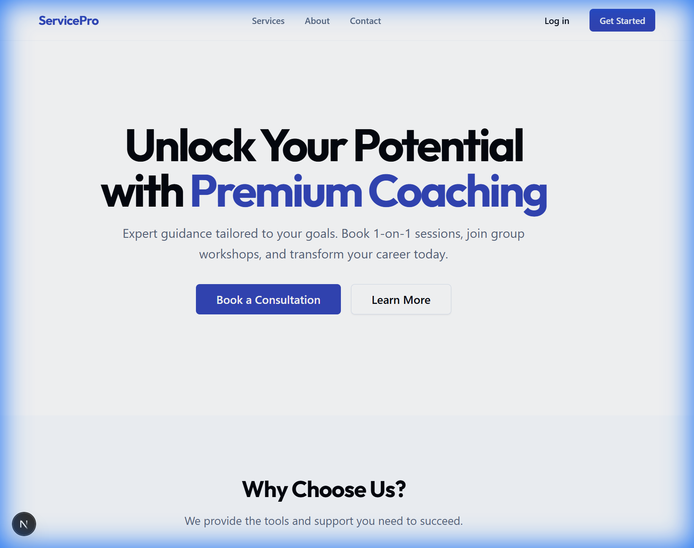
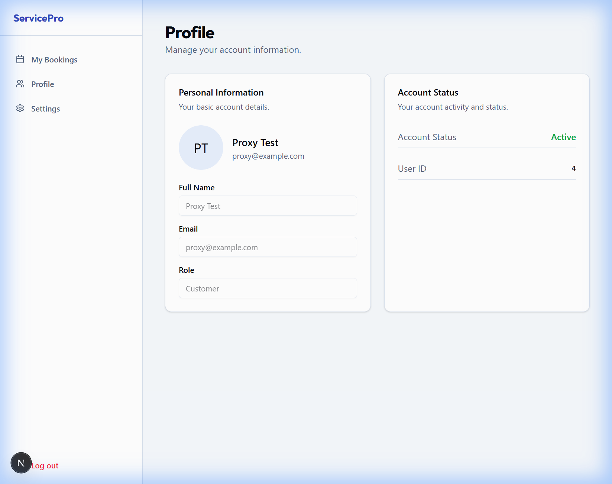

# 🚀 Service Booking & Management Platform (Demo #2)

> **A production-ready, full-stack SaaS solution for service-based businesses**

Built to showcase enterprise-level development skills for coaching, consulting, and appointment-based services.

[](https://nextjs.org/)
[](https://fastapi.tiangolo.com/)
[](https://www.typescriptlang.org/)

---

## 📸 Live Preview

### Public-Facing Experience
Professional, conversion-optimized interface for potential clients.

<table>
  <tr>
    <td></td>
    <td></td>
  </tr>
  <tr>
    <td align="center"><b>Landing Page</b></td>
    <td align="center"><b>Service Catalog</b></td>
  </tr>
</table>

### Client Portal
Intuitive dashboard for users to manage their bookings and profile.

<table>
  <tr>
    <td></td>
    <td></td>
  </tr>
  <tr>
    <td align="center"><b>User Dashboard</b></td>
    <td align="center"><b>Profile Management</b></td>
  </tr>
</table>

### Admin Command Center
Powerful tools for business owners to manage operations.

<table>
  <tr>
    <td></td>
    <td></td>
  </tr>
  <tr>
    <td align="center"><b>Availability Management</b></td>
    <td align="center"><b>Service Management</b></td>
  </tr>
</table>

---

## ✨ Key Features

- 🔐 **Secure Authentication** - JWT tokens with HTTP-only cookies
- 📅 **Smart Booking Engine** - Conflict detection, time-slot generation
- 👤 **Client Portal** - View bookings, manage profile
- 🛠️ **Admin Dashboard** - Full CRUD for services, bookings, availability
- 📊 **Analytics** - Real-time metrics on bookings and revenue
- 🎨 **Premium UI** - Built with Next.js, Tailwind CSS, and Shadcn/UI

---

## 🛠️ Tech Stack

| Layer | Technology |
|-------|-----------|
| **Frontend** | Next.js 15 (App Router), React, TypeScript, Tailwind CSS |
| **Backend** | FastAPI (Python), SQLModel, SQLite/PostgreSQL |
| **Auth** | JWT + HTTP-Only Cookies |
| **UI Components** | Shadcn/UI |
| **API Design** | RESTful with auto-generated docs |

---

## 🚀 Quick Start

### Prerequisites
- **Node.js** 18+ and **npm**
- **Python** 3.9+

### Installation

1. **Clone the repository**
   ```bash
   git clone https://github.com/warrior-ram/demo-Service-Booking-Management-Platform.git
   cd demo-Service-Booking-Management-Platform
   ```

2. **Backend Setup**
   ```bash
   cd backend
   pip install -r requirements.txt
   uvicorn app.main:app --reload
   ```
   Backend runs on `http://localhost:8000`

3. **Frontend Setup**
   ```bash
   cd frontend
   npm install
   npm run dev
   ```
   Frontend runs on `http://localhost:3000`

4. **Access the Application**
   - Public site: `http://localhost:3000`
   - API docs: `http://localhost:8000/docs`

---

## 📖 Documentation

**[View Full Walkthrough](./WALKTHROUGH/WALKTHROUGH.md)** - Detailed feature showcase with technical architecture

---

## 🎯 Project Highlights

This project demonstrates:
- ✅ Complex business logic (time-slot availability algorithm)
- ✅ Secure authentication and authorization
- ✅ Modern full-stack architecture
- ✅ Production-grade code quality
- ✅ Responsive, accessible UI design
- ✅ RESTful API design with FastAPI

---

## 📬 Contact

**Built by:** [Your Name]  
**Portfolio:** [Your Portfolio URL]  
**Available for:** Full-stack development projects, SaaS solutions

---

⭐ **Star this repo** if you find it useful for your learning or portfolio!
