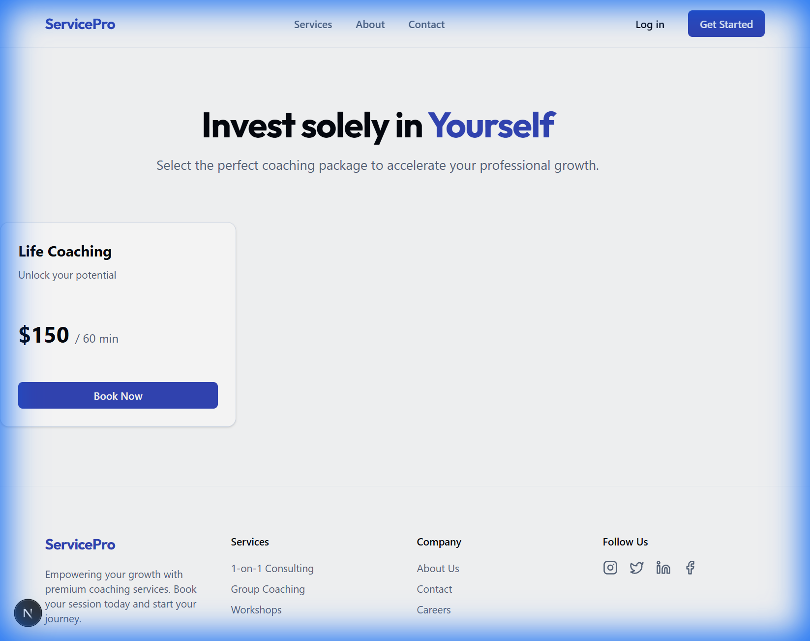
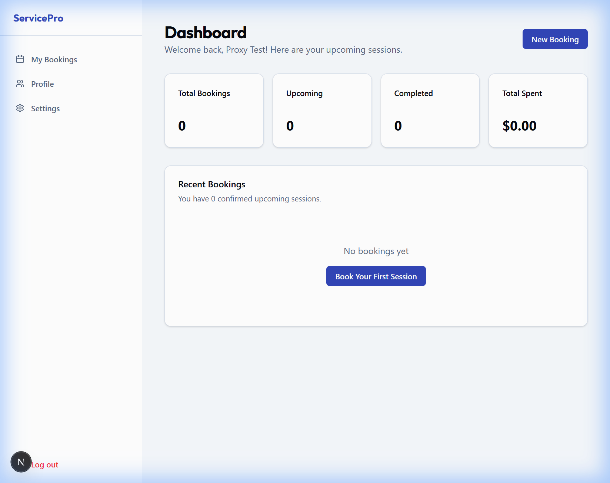
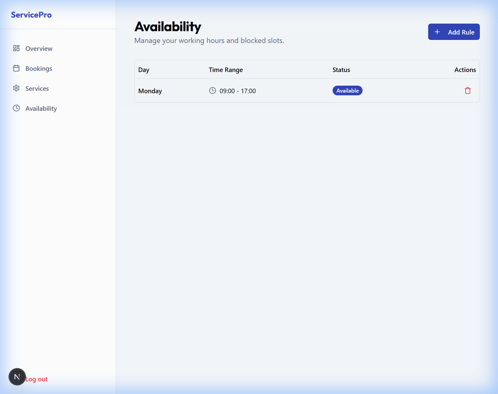
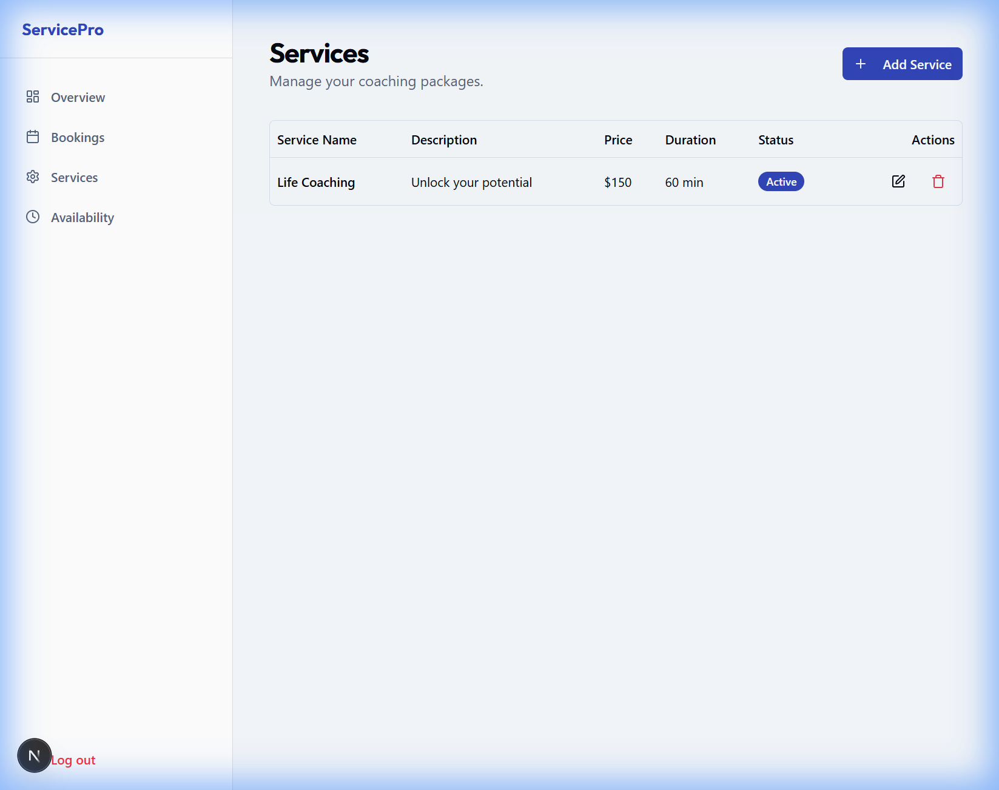
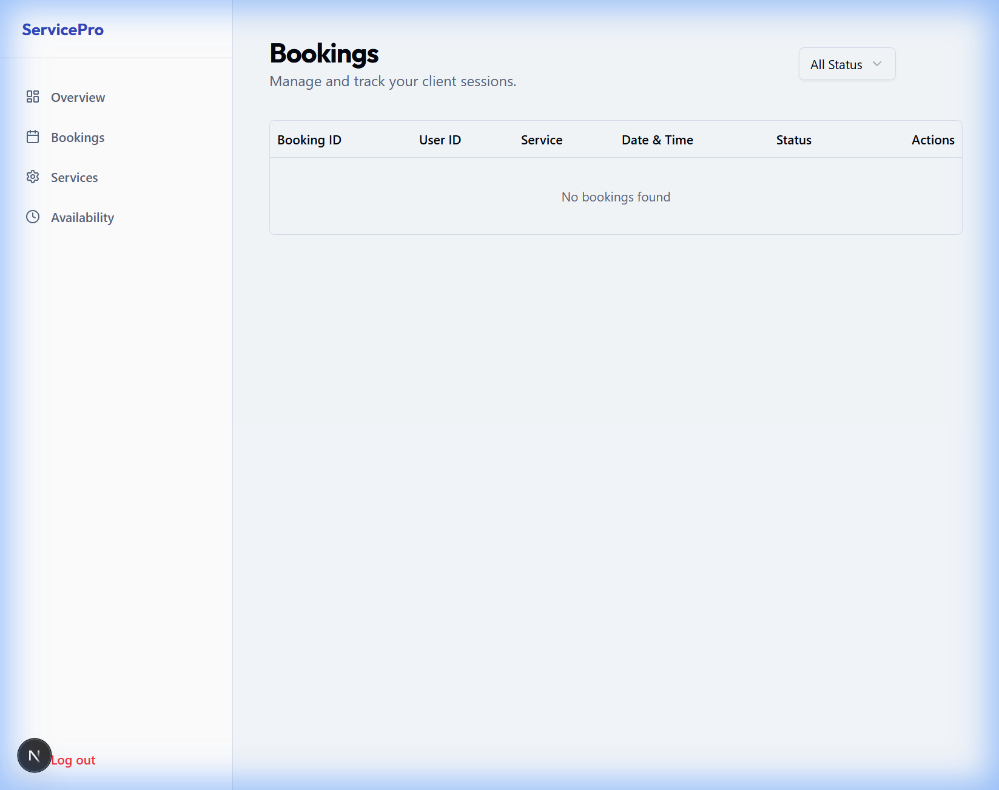

# Portfolio Showcase: Service Booking Platform ("Demo 2")

**A State-of-the-Art, Full-Stack Booking & Management Solution**

## Executive Summary

This project represents a production-ready, full-stack SaaS solution designed for service-based businesses (coaches, consultants, therapists). It goes beyond simple scheduling, offering a comprehensive ecosystem for managing services, availability, and client relationships. Built with a "sellable" philosophy, it features a premium aesthetic, robust security, and scalable architecture.

## 🚀 Key Features Visualized

### 1. The Public Experience

Designed to convert visitors into clients with a professional, trustworthy aesthetic.

````carousel

**Hero Section**: A high-impact landing page with clear value propositions and call-to-action.
<!-- slide -->

**Service Catalog**: Dynamic grid display of services fetched from the backend, featuring pricing, duration, and descriptions.
<!-- slide -->

**Authentication**: Secure, branded login/signup flows using JWTs and HTTP-only cookies for maximum security.
````

### 2. The Client Portal

A dedicated space for clients to manage their journey.

````carousel

**Client Dashboard**: Personal command center showing upcoming appointments and booking history.
<!-- slide -->

**Profile Management**: Clients can manage their personal details and account settings.
````

### 3. The Admin Command Center

Powerful tools for business owners to control their operations.

````carousel

**Availability Engine**: Complex logic simplified. Admins set weekly working hours and block out specific times.
<!-- slide -->

**Service Control**: Full CRUD capabilities to launch new service packages instantly.
<!-- slide -->

**Booking Oversight**: Review, approve, or cancel bookings with email notification triggers.
````

## 🛠 Technical Architecture

This demo showcases a modern, scalable tech stack preferred by high-growth startups:

| Component | Technology | Why it matters |
|-----------|------------|----------------|
| **Frontend** | **Next.js 15 (App Router)** | SEO-optimized, blazing fast server-side rendering. |
| **UI Framework** | **React + Tailwind CSS** | Custom, pixel-perfect design system without bloat. |
| **Backend** | **FastAPI (Python)** | High-performance async API, auto-generated docs. |
| **Database** | **SQLModel (SQLite/Postgres)** | Robust relational data modeling. |
| **Security** | **JWT + HTTP-Only Cookies** | Bank-grade authentication flow. |

## 🌟 Why This Project Stands Out

- **Business Logic Complexity**: successfully handles the difficult logic of time-slot generation, conflict detection, and timezone management.
- **Production Grade**: Includes proper error handling, form validation (Zod/Pydantic), and responsive layouts.
- **Admin-First Design**: Prioritizes the tools business owners actually need to run their company.

---
*Created by [Your Name] - Available for Full-Stack Development Projects*
